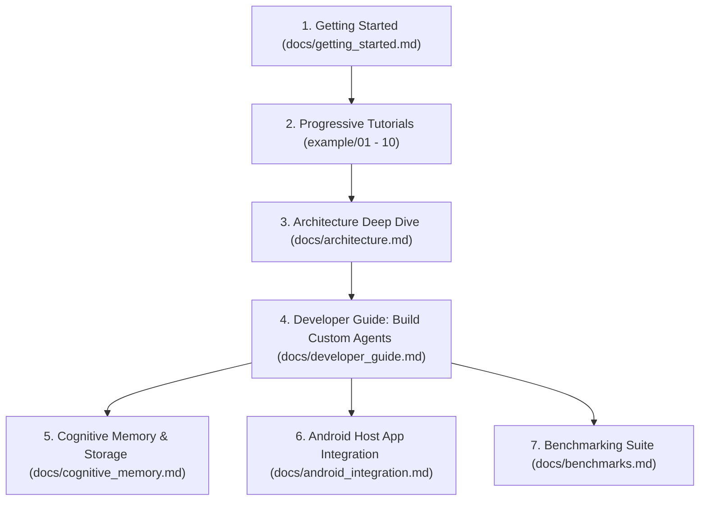

# mobi-nooa Documentation & Technical Training Hub

Welcome to the **mobi-nooa** developer and architectural documentation hub. This repository contains the complete Dart and Kotlin implementation of **NVIDIA Object-Oriented Agents (NOOA)** ([arXiv:2607.20709](https://arxiv.org/abs/2607.20709)) tailored for modern Android mobile devices.

---

## 📚 Documentation Index

### 🚀 Getting Started & Onboarding
- **[Getting Started Guide](./getting_started.md)** — Set up your development environment and run your first autonomous agent in under 5 minutes.
- **[Progressive Examples Catalog](../mobi_nooa_core/example/README.md)** — 10 step-by-step runnable tutorials covering core concepts from basic generation to multi-agent pipelines.

### 🏛️ Architecture & Core Principles
- **[System Architecture Guide](./architecture.md)** — Complete breakdown of the 6 NOOA principles, execution loop, pure Dart core, and Android native bridge.
- **[ObjectHeap & Pass-by-Reference](./pass_by_reference_heap.md)** — How `#ref_xxx` handles and bounded preview generators eliminate LLM prompt context bloat.
- **[CodeAct Sandbox & AST Security](./code_act_and_security.md)** — Executing code actions on mobile with strict AST guardrails.
- **[Cognitive Memory & ACT-R Theory](./cognitive_memory.md)** — The mathematical model behind ACT-R activation ($A_i = B_i + W \cdot \text{Importance} + S_{ji}$), Ebbinghaus power-law decay, and owner-gated multi-tenant isolation.
- **[State Checkpointing & SQLite Persistence](./state_storage_and_checkpoints.md)** — How `AgentCheckpoint` and `StateStorageManager` enable seamless pause, resume, and crash recovery.

### 🛠️ Developer & Platform Guides
- **[Model Configuration Guide](./model_configuration.md)** — Setting up NVIDIA NIM (free evaluation credits, dynamic model lookup CLI), Google Gemini, OpenAI, Claude, Ollama, and local on-device SLMs.
- **[Reference Agents & Built-in Harnesses](./reference_agents.md)** — Guide to the 5 built-in agents, model provisioning, skills integration, and activation architecture.
- **[Developer Guide](./developer_guide.md)** — Best practices for creating new `NooaAgent` subclasses, custom tools, and pluggable `ExecutionStrategy` implementations.
- **[Android Platform Integration](./android_integration.md)** — Headless Flutter engine embedding, `MethodChannel` dispatch, Foreground Services (`MobiNooaService`), and WorkManager (`MobiNooaWorker`).
- **[Benchmarking & Evaluation Suite](./benchmarks.md)** — SWE-bench Verified and MobileBench evaluation harnesses, metric calculation, and JSONL reporting.

### 📋 Architecture Decision Records (ADRs)
- **[ADR 0001: Adopt NOOA Architecture](./decisions/0001-adopt-nooa-architecture.md)**
- **[ADR 0002: Cognitive Memory Subsystem](./decisions/0002-cognitive-memory-subsystem.md)**
- **[ADR 0003: Pluggable Execution Strategies](./decisions/0003-pluggable-execution-strategies.md)**
- **[ADR 0004: SQLite Checkpoint Persistence](./decisions/0004-sqlite-checkpoint-persistence.md)**
- **[ADR 0005: AST Security Guardrails](./decisions/0005-ast-security-guardrails.md)**
- **[ADR 0006: BenchAgent & SWE-bench Benchmarking](./decisions/0006-benchagent-and-benchmarking.md)**
- **[ADR 0007: Headless Bridge Architecture](./decisions/0007-close-dart-android-bridge-gap.md)**
- **[ADR 0008: On-Device LLM Runtime Architecture (llama.cpp + LiteRT-LM)](./decisions/0008-on-device-llm-runtime-architecture.md)**
- **[ADR 0009: Two-Way Runtime Agent Skills Subsystem (nooa-skills)](./decisions/0009-runtime-skills-subsystem.md)**

---

## 🗺️ Learning Path

