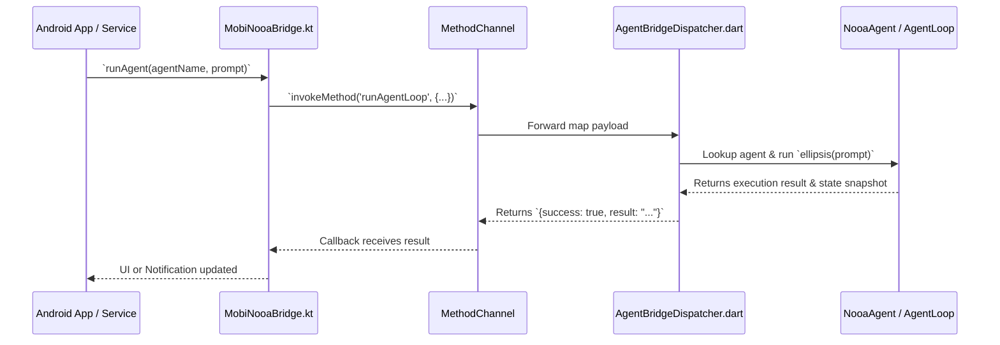

# Android Native Host Integration

This guide explains how the native Android layer (`android_mobi_nooa`) embeds and executes the pure Dart core (`mobi_nooa_core`) on physical devices.

---

## 📱 1. Architecture Overview (ADR 0007)

`mobi-nooa` uses a headless Flutter engine "add-to-app" embedding. This eliminates the need for manual C-FFI boilerplate and allows Kotlin code to invoke the agent runtime via a single `MethodChannel` (`mobi.nooa/agent_bridge`).



---

## 🏃 2. Android Foreground Service (`MobiNooaService`)

To ensure complex, multi-step agent loops are not killed by Android's battery manager when the user switches apps or turns off the screen, `MobiNooaService` runs as an Android Foreground Service with an ongoing status notification:

```kotlin
// Starting a background agent loop from Android
val intent = Intent(context, MobiNooaService::class.java).apply {
    action = MobiNooaService.ACTION_START_AGENT
    putExtra(MobiNooaService.EXTRA_AGENT_NAME, "GeneralMobileAgent")
    putExtra(MobiNooaService.EXTRA_PROMPT, "Monitor battery and backup daily notes.")
}
context.startForegroundService(intent)
```

---

## ⏰ 3. WorkManager Periodic Background Execution (`MobiNooaWorker`)

For periodic tasks (e.g. memory consolidation, Ebbinghaus decay calculation, daily system cleanup), `MobiNooaWorker` provides scheduled execution:

```kotlin
val agentWork = PeriodicWorkRequestBuilder<MobiNooaWorker>(
    12, TimeUnit.HOURS
).build()

WorkManager.getInstance(context).enqueueUniquePeriodicWork(
    "mobi_nooa_memory_consolidation",
    ExistingPeriodicWorkPolicy.KEEP,
    agentWork
)
```

---

## ⚡ 4. On-Device AI Inference (`OnDeviceModelEngine`)

For offline execution without internet connectivity, `OnDeviceModelEngine` bridges to mobile NPU/GPU runtimes:
- **Google LiteRT** (TensorFlow Lite)
- **MediaPipe GenAI Task** (Gemma 2B / Phi-3 / Qwen)
- **llama.cpp / ExecuTorch** (GGUF quantized models)
