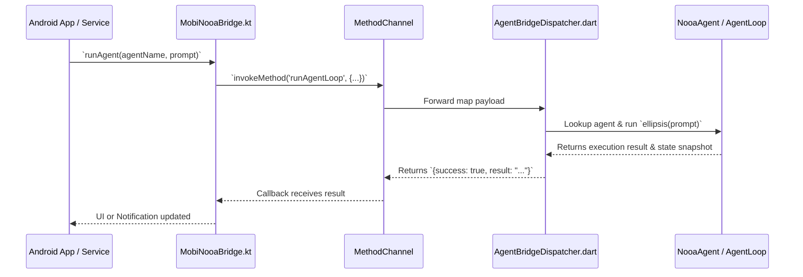

# Android Native Host Integration

This guide explains how the native Android layer (`android_mobi_nooa`) embeds and executes the pure Dart core (`mobi_nooa_core`) on physical devices.

---

## 📱 1. Architecture Overview (ADR 0007)

`mobi-nooa` uses a headless Flutter engine "add-to-app" embedding. This eliminates the need for manual C-FFI boilerplate and allows Kotlin code to invoke the agent runtime via a single `MethodChannel` (`mobi.nooa/agent_bridge`).



---

## 🏃 2. Android Foreground Service (`MobiNooaService`)

To ensure complex, multi-step agent loops are not killed by Android's battery manager when the user switches apps or turns off the screen, `MobiNooaService` runs as an Android Foreground Service with an ongoing status notification:

```kotlin
// Starting a background agent loop from Android
val intent = Intent(context, MobiNooaService::class.java).apply {
    action = MobiNooaService.ACTION_START_AGENT
    putExtra(MobiNooaService.EXTRA_AGENT_NAME, "GeneralMobileAgent")
    putExtra(MobiNooaService.EXTRA_PROMPT, "Monitor battery and backup daily notes.")
}
context.startForegroundService(intent)
```

---

## ⏰ 3. WorkManager Periodic Background Execution (`MobiNooaWorker`)

For periodic tasks (e.g. memory consolidation, Ebbinghaus decay calculation, daily system cleanup), `MobiNooaWorker` provides scheduled execution:

```kotlin
val agentWork = PeriodicWorkRequestBuilder<MobiNooaWorker>(
    12, TimeUnit.HOURS
).build()

WorkManager.getInstance(context).enqueueUniquePeriodicWork(
    "mobi_nooa_memory_consolidation",
    ExistingPeriodicWorkPolicy.KEEP,
    agentWork
)
```

---

## ⚡ 4. On-Device AI Inference (`OnDeviceModelEngine` & ADR 0008)

For completely offline execution without cloud APIs, `OnDeviceModelEngine` implements a tiered, pluggable engine architecture (`ILocalInferenceEngine`):

1. **Universal Foundation (`LlamaCppInferenceEngine`)**:
   - `llama.cpp` embedded via JNI / ARM64 NEON with optional Vulkan acceleration.
   - Runs standard GGUF quantized models (Llama 3.2 1B/3B, Qwen 2.5 1.5B/3B, SmolLM).
   - Supports prompt streaming via Kotlin Flow and cancellation.

2. **NPU Hardware Acceleration (`LiteRtLmInferenceEngine`)**:
   - Google LiteRT-LM / MediaPipe GenAI for accelerated Gemma 2 / Llama models on devices with specialized NPUs.

3. **Storage & Verification (`ModelStorageManager`)**:
   - Manages app-private storage (`context.filesDir/models/`), parses GGUF binary headers, and validates SHA-256 checksums.

4. **Lifecycle & Memory Safeguards**:
   - Automatically sheds KV-cache and cancels workloads upon Android OS critical memory pressure (`ComponentCallbacks2.onTrimMemory`).

---

## 🏛️ 5. Modern Kotlin Clean Architecture & Jetpack Compose Bindings

`android_mobi_nooa` follows strict Google Android Clean Architecture Guidelines with decoupled **Domain**, **Data**, and **Presentation (MVI/UDF)** layers:

### A. Domain Layer (Pure Kotlin Models & Single-Responsibility Use Cases)
- **Domain Models** (`com.mobi.nooa.domain`):
  - `AgentModels.kt`: `AgentExecutionResult`, `AgentState`, `AgentInfo`, `HardwareTelemetry`, `GovernorBudget`, `PluginInfo`, `SessionInfo`, `ModelConfig` (Mock, OnDevice, DeepSeek, Nvidia, Cloud), `AgentOperatingMode`.
- **Domain Use Cases** (`com.mobi.nooa.domain.usecases`):
  - `ExecuteAgentTaskUseCase`: Validates parameters and triggers autonomous agent loops.
  - `ListRegisteredAgentsUseCase`: Retrieves available reference agents with rich capability metadata.
  - `GetDeviceTelemetryUseCase`: Queries live battery, thermal, and RAM headroom.
  - `ManageSessionUseCase`: Orchestrates time-travel replay and branch forking.
  - `ManagePluginsUseCase`: Lists active dynamic tool and telemetry plugins.
  - `AssessGovernorBudgetUseCase`: Calculates real-time concurrency caps and thermal throttling delays.

### B. Data Layer (`DefaultAgentRepository` & `MobiNooaBridge`)
- `DefaultAgentRepository`: Bridges Kotlin domain operations to the headless Dart engine over `MobiNooaBridge` and `DeviceHarnessBridge`.
- `MobiNooaBridge`: Single process-wide singleton executing inside a background `FlutterEngine`.

### C. Presentation Layer (MVI / UDF ViewModels & Jetpack Compose)
- `AgentViewModel`: General-purpose agent coordinator with reactive `StateFlow<AgentState>`.
- `AgentHubViewModel`: Dashboard state, mode pills, model switcher, and hardware status chips.
- `AgentExecutionViewModel`: Live trajectory stream, DeepSeek-R1 reasoning thought accordion (`reasoningContent`), CodeAct diffs, `#ref_xxx` heap handles, and interactive permission sheets.
- `SessionTimelineViewModel`: Time-travel step scrubber and branch forker.
- `ResourceGovernorViewModel`: Hardware telemetry gauges, heap compaction triggers, and adaptive load balancer.

### D. Dependency Injection (`MobiNooaContainer` & `MobiNooaViewModelFactory`)
```kotlin
class MainActivity : AppCompatActivity() {
    override fun onCreate(savedInstanceState: Bundle?) {
        super.onCreate(savedInstanceState)
        
        // 1. Initialize Dependency Container
        val container = MobiNooaContainer(applicationContext)

        // 2. Obtain ViewModels via Custom Factory
        val factory = MobiNooaViewModelFactory(container)
        val agentViewModel = ViewModelProvider(this, factory)[AgentViewModel::class.java]
        val hubViewModel = ViewModelProvider(this, factory)[AgentHubViewModel::class.java]
    }
}
```

