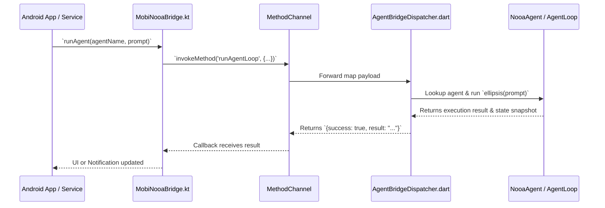

# Android Native Host Integration

This guide explains how the native Android layer (`android_mobi_nooa`) embeds and executes the pure Dart core (`mobi_nooa_core`) on physical devices.

---

## 📱 1. Architecture Overview (ADR 0007)

`mobi-nooa` uses a headless Flutter engine "add-to-app" embedding. This eliminates the need for manual C-FFI boilerplate and allows Kotlin code to invoke the agent runtime via a single `MethodChannel` (`mobi.nooa/agent_bridge`).



---

## 🏃 2. Android Foreground Service (`MobiNooaService`)

To ensure complex, multi-step agent loops are not killed by Android's battery manager when the user switches apps or turns off the screen, `MobiNooaService` runs as an Android Foreground Service with an ongoing status notification:

```kotlin
// Starting a background agent loop from Android
val intent = Intent(context, MobiNooaService::class.java).apply {
    action = MobiNooaService.ACTION_START_AGENT
    putExtra(MobiNooaService.EXTRA_AGENT_NAME, "GeneralMobileAgent")
    putExtra(MobiNooaService.EXTRA_PROMPT, "Monitor battery and backup daily notes.")
}
context.startForegroundService(intent)
```

---

## ⏰ 3. WorkManager Periodic Background Execution (`MobiNooaWorker`)

For periodic tasks (e.g. memory consolidation, Ebbinghaus decay calculation, daily system cleanup), `MobiNooaWorker` provides scheduled execution:

```kotlin
val agentWork = PeriodicWorkRequestBuilder<MobiNooaWorker>(
    12, TimeUnit.HOURS
).build()

WorkManager.getInstance(context).enqueueUniquePeriodicWork(
    "mobi_nooa_memory_consolidation",
    ExistingPeriodicWorkPolicy.KEEP,
    agentWork
)
```

---

## ⚡ 4. On-Device AI Inference (`OnDeviceModelEngine` & ADR 0008)

For completely offline execution without cloud APIs, `OnDeviceModelEngine` implements a tiered, pluggable engine architecture (`ILocalInferenceEngine`):

1. **Universal Foundation (`LlamaCppInferenceEngine`)**:
   - `llama.cpp` embedded via JNI / ARM64 NEON with optional Vulkan acceleration.
   - Runs standard GGUF quantized models (Llama 3.2 1B/3B, Qwen 2.5 1.5B/3B, SmolLM).
   - Supports prompt streaming via Kotlin Flow and cancellation.

2. **NPU Hardware Acceleration (`LiteRtLmInferenceEngine`)**:
   - Google LiteRT-LM / MediaPipe GenAI for accelerated Gemma 2 / Llama models on devices with specialized NPUs.

3. **Storage & Verification (`ModelStorageManager`)**:
   - Manages app-private storage (`context.filesDir/models/`), parses GGUF binary headers, and validates SHA-256 checksums.

4. **Lifecycle & Memory Safeguards**:
   - Automatically sheds KV-cache and cancels workloads upon Android OS critical memory pressure (`ComponentCallbacks2.onTrimMemory`).

---

## 🏛️ 5. Modern Kotlin Architecture & Jetpack Compose Bindings

`android_mobi_nooa` follows standard Google Android Architecture Guidelines with clean Domain, Data, and Presentation layers:

### A. Domain Layer (`AgentRepository` & `AgentState`)
```kotlin
// Inject repository into your ViewModels / UseCases
val repository: AgentRepository = DefaultAgentRepository(MobiNooaBridge.getInstance(context))

// Observe reactive state
lifecycleScope.launch {
    repository.agentState.collect { state ->
        when (state) {
            is AgentState.Idle -> showIdleState()
            is AgentState.Running -> showProgress(state.currentStep, state.maxSteps)
            is AgentState.Success -> renderResult(state.result.resultText)
            is AgentState.Failed -> showError(state.error)
        }
    }
}
```

### B. Presentation Layer (`AgentViewModel`)
```kotlin
class MyAgentScreenViewModel(
    private val agentViewModel: AgentViewModel
) : ViewModel() {
    val uiState: StateFlow<AgentState> = agentViewModel.agentState

    fun runTriage() {
        agentViewModel.executeTask(
            agentName = "AutonomousDeviceAgent",
            goal = "Triage battery drain and inspect background processes",
            modelConfig = ModelConfig.OnDevice(template = "llama3")
        )
    }
}
```
