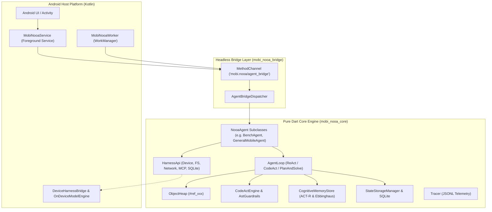

# mobi-nooa System Architecture

**`mobi-nooa`** is a mobile-first implementation of NVIDIA's Object-Oriented Agents (NOOA) framework ([arXiv:2607.20709](https://arxiv.org/abs/2607.20709)). It enables modern Android mobile phones to function as autonomous, self-contained AI agent runtimes with or without active server connectivity.

---

## 🏛️ High-Level System Architecture



---

## 💎 The 6 NOOA Principles in mobi-nooa

### Principle 1: Typed Input/Output (Class-as-Agent)
- In `mobi-nooa`, an agent is a standard Dart class extending `NooaAgent`.
- Doc comments (`///`) and type annotations on registered actions automatically synthesize LLM system prompts and tool schemas via `AgentReflector`.
- Eliminates brittle string prompt engineering in favor of compiler-checked Dart types.

### Principle 2: Pass-by-Reference over Live Objects
- Mobile RAM and LLM context windows are precious.
- Large objects (dataframes, binary blobs, multi-thousand-row sensor logs) reside in `ObjectHeap` and are assigned a reference handle (e.g., `#ref_1`).
- The LLM context receives a token-bounded summary preview (via `BoundedPreviewGenerator`), and tools resolve handles on demand via `context.heap.resolveHandleOrValue()`.

### Principle 3: Code as Action (CodeAct)
- Rather than executing single tools sequentially, LLMs can emit multi-statement code blocks in ```dart or ```python syntax.
- Evaluated in `SandboxedEnvironment` through `AstEvaluator`.
- Protected by `AstGuardrails`, which validates syntax trees before execution to block dangerous imports, forbidden reflection, and infinite loops.

### Principle 4: Programmable Loop Engineering
- The execution loop is an explicit, programmable state machine managed by `AgentLoop`.
- Pluggable `ExecutionStrategy` implementations (`ReActStrategy`, `CodeActStrategy`, `PlanAndSolveStrategy`, `SelfReflectionStrategy`) decouple reasoning patterns from loop mechanics.

### Principle 5: Explicit Object State
- Agents maintain explicit, reactive state via `setState(key, value)` and `getState(key)`.
- State changes emit events on `onStateChanged`, allowing Android UIs and notification channels to reflect live agent progress reactively.
- The complete agent state is snapshot-ready for persistence and crash recovery.

### Principle 6: Model-Callable Harness APIs
- System capabilities are encapsulated in typed harnesses under `lib/src/harness/`:
  - `DeviceHarness`: Battery, location, notifications, vibrator.
  - `FileSystemHarness`: Sandboxed file read, write, append, delete.
  - `NetworkHarness`: HTTP GET, POST, headers.
  - `MemoryHarness`: Key-value store and vector embeddings.
  - `SqliteHarness`: Structured relational SQL queries.
  - `McpHarness`: Model Context Protocol integration.

---

## 📦 Package Separation & Decoupling

| Module | Language | Dependencies | Role |
|---|---|---|---|
| `mobi_nooa_core/` | Pure Dart | No Flutter, No `dart:ui` | Portable agent engine runnable on CLI, server, isolate, or mobile. |
| `android_mobi_nooa/` | Kotlin | Android SDK, WorkManager | Native Android services, notification management, hardware bridges. |
| `mobi_nooa_bridge/` | Flutter / Dart | Flutter Engine | Thin, headless `add-to-app` shim connecting `MethodChannel` to `AgentBridgeDispatcher`. |
