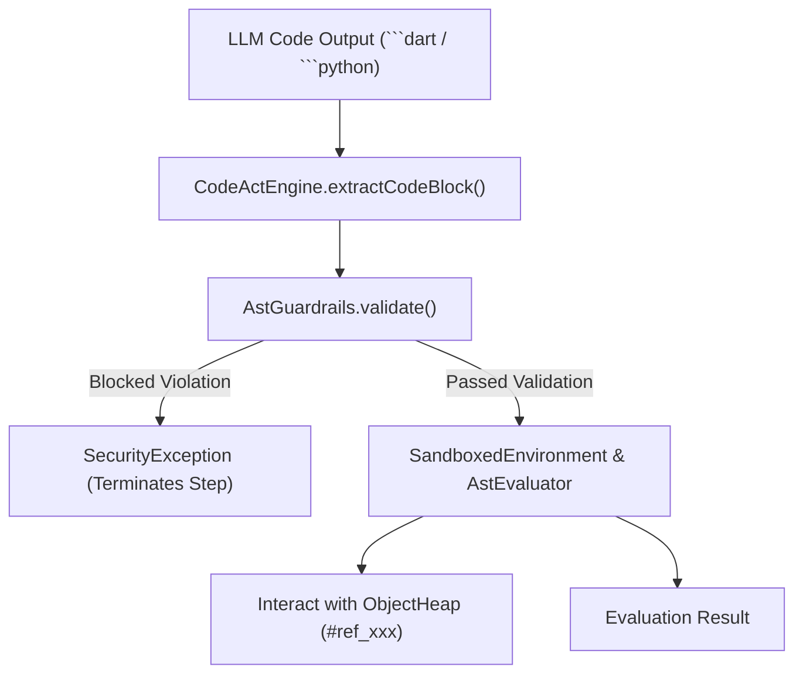

# CodeAct Sandbox & AST Security Guardrails

**Code as Action (CodeAct - NOOA Principle 3)** allows LLMs to emit executable multi-statement scripts rather than single sequential tool calls. This allows agents to perform complex loops, filters, aggregations, and multi-step logic in a single turn.

To ensure safety on mobile devices, `mobi-nooa` runs all snippets through an AST validation guardrail before execution in a sandboxed environment.

---

## 🛡️ 1. Security Architecture & Flow



---

## 🚫 2. AST Security Guardrails (`AstGuardrails`)

Before executing any LLM-authored code snippet, `AstGuardrails.validate(code)` parses the snippet into an Abstract Syntax Tree (AST) and checks for dangerous patterns:

### Denylisted Identifiers & Modules
- **Dangerous System Imports**: `dart:io`, `dart:ffi`, `dart:isolate`, `dart:html`, `dart:js`, `java.lang`, `os.system`, `subprocess`.
- **Dangerous Reflection / Execution Calls**: `Process.run`, `Process.start`, `exit()`, `eval()`, `exec()`, `MethodChannel.invokeMethod`, `dart:mirrors`.
- **System Resource Abuse**: Spawning background isolates or creating unrestricted network sockets directly without going through `NetworkHarness`.

### Resource Caps
- **Max AST Depth**: Limits recursion depth to prevent stack overflow exploits.
- **Loop Iteration Caps**: Prevents `while(true)` runaway loops from freezing mobile UI threads.

---

## 📦 3. Sandboxed Built-in Functions

The mobile `SandboxedEnvironment` exposes safe, pure utility functions:

- `sum(list)`: Computes sum of numeric collections.
- `avg(list)`: Computes arithmetic mean.
- `min(list)` / `max(list)`: Finds extremums.
- `len(collection)`: Returns length of string or list.
- `jsonEncode(object)` / `jsonDecode(string)`: Safe JSON serialization.
- `heap.get("#ref_xxx")`: Accesses live objects in `ObjectHeap`.
- `device`, `fs`, `network`, `memory`: Safe harness references.

---

## 🧪 4. Code Example

```dart
final engine = CodeActEngine(
  environment: SandboxedEnvironment(heap: context.heap),
);

// Executing code against live heap objects
final result = await engine.execute('''
  var dataset = heap.get("#ref_1");
  var highTemps = dataset.where((r) => r["temp"] > 25.0).toList();
  var average = avg(highTemps.map((r) => r["temp"]).toList());
  return average;
''');
```
