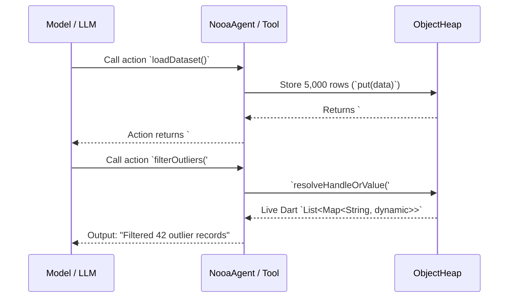

# ObjectHeap & Pass-by-Reference (Principle 2)

On mobile devices, memory constraints and LLM context window costs make it impractical to pass multi-megabyte payloads, 10,000-row tabular datasets, or large file buffers directly through LLM prompt strings.

**`ObjectHeap`** implements **NOOA Principle 2: Pass-by-Reference over Live Objects**.

---

## 🎯 1. How It Works



---

## 🔍 2. Bounded Preview Generation

When an object is registered into `ObjectHeap`, the `BoundedPreviewGenerator` generates a token-bounded summary:

- **Lists**: Shows the first 5 elements and total count: `[item1, item2, item3, item4, item5, ... and 4995 more items] (total length: 5000)`.
- **Maps**: Shows keys and sample values: `{key1: val1, key2: val2, ... and 48 more keys}`.
- **Large Strings / Buffers**: Slices the head and tail with ellipsis: `"Start of file... [24,500 bytes] ...End of file"`.

This allows the LLM to understand data shape and types without consuming thousands of context tokens.

---

## 🛠️ 3. Automatic Heap Wrapping

`ObjectHeap.maybeWrap(value)` automatically detects large return values from actions and converts them to heap references if they exceed `autoReferenceThresholdBytes` (default: 300 bytes or >5 items):

```dart
// If return value is a 10,000-row list, maybeWrap puts it into the heap:
final result = context.heap.maybeWrap(largeDataset, label: 'AnalyticsDataset');
// result is an ObjectReference with handle '#ref_2'
```

---

## 📋 4. ObjectHeap API Reference

| Method | Description |
|---|---|
| `put(object, {label, preferredHandle})` | Stores a live object and returns an `ObjectReference`. |
| `get(handle)` | Retrieves the live Dart instance by handle string (`#ref_xxx`). |
| `contains(handle)` | Returns `true` if handle exists in heap. |
| `maybeWrap(value)` | Auto-allocates large objects to heap while passing primitives as-is. |
| `resolveHandleOrValue(input)` | Resolves handle string `#ref_xxx` to live instance, or returns input as-is. |
| `toPromptSummary()` | Formats markdown table of active heap references for system prompts. |
